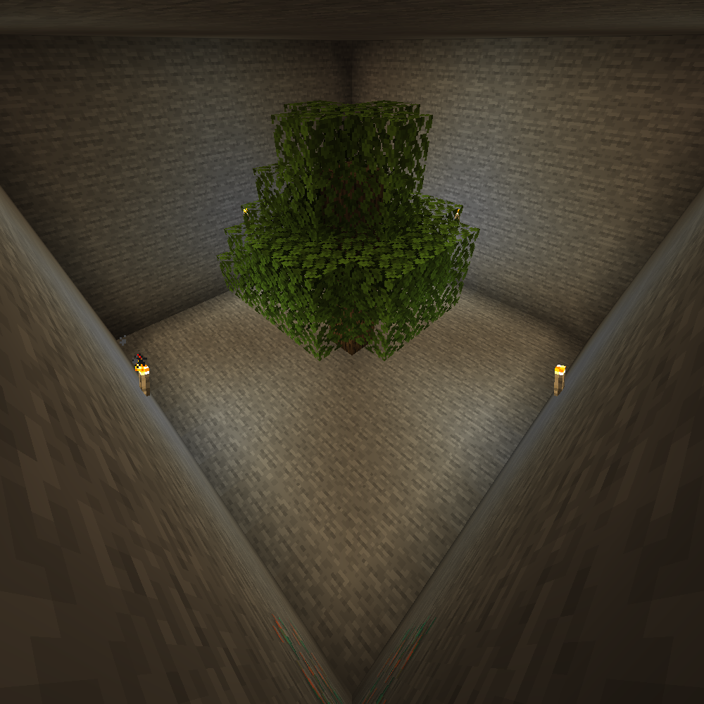

# CaveStone

**CaveStone** is a modpack which you never saw before! Obviously, it's a new pack.

You may be familiar with the concept of the pack but without being familiar with it at all. You'll land in a world
filled with stone. Sounds like Stoneblock, I know, I know... But wait for the additional features!

You will not have a mod for resources, you need to dig for your resources. This modpack aims
to be very vanilla. There are a few mods, but no big tech mod. Ores do generate in the world. Some
structures do generate in the world.

The advancements are meant to be the quest line. It's growing with each update. If you're playing a 0.x.x version of
the pack, you're not playing the full version of the pack, and I really need additional feedback!

The mods still aren't final. I'm still waiting for a few mods to be ported to 1.19, or fixed with the newest Forge
version.

Here, you can see one of the 3 possible spawns:

That is the default spawn cave. There are two versions which add more initial blocks.
You'll spawn with a custom wooden pickaxe and maybe... you'll find a treasure nearby?

Come, dive in the world full of stone!

For help with the modpack, feel free to visit my discord server (sorry, most of it is
German, but just writing in English is fine)!

## Need to re-add
- [Inventory Sorter](https://www.curseforge.com/minecraft/mc-mods/inventory-sorter)
- [Spice of Life: Carrot Edition](https://www.curseforge.com/minecraft/mc-mods/spice-of-life-carrot-edition)

## Waiting for port
- [AgriCraft](https://www.curseforge.com/minecraft/mc-mods/agricraft)
- [CobbleForDays](https://www.curseforge.com/minecraft/mc-mods/cobblefordays)
- [Create](https://www.curseforge.com/minecraft/mc-mods/create)

## Not Sure Yet
- [Dark Utilities](https://www.curseforge.com/minecraft/mc-mods/dark-utilities)
- [Pipez](https://www.curseforge.com/minecraft/mc-mods/pipez)
- [Quark](https://www.curseforge.com/minecraft/mc-mods/quark)
